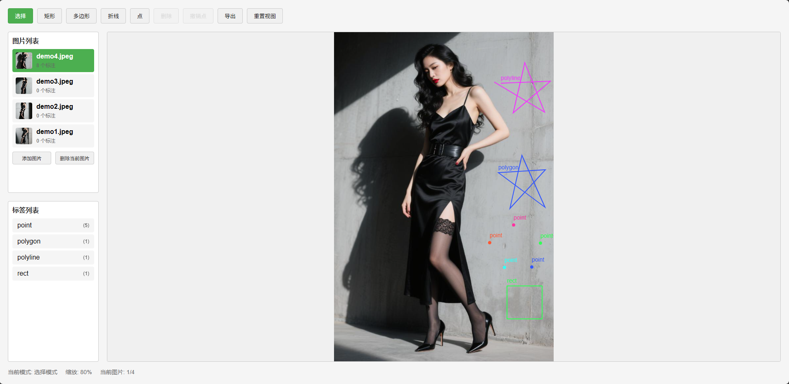

# <div align=center>图片标注工具</div>

## 使用说明
 - <b>数据没有上传到服务器，可完全放心使用 !</b>
 - <b>没做缓存功能 ，刷新/关闭页面后数据会丢失 !</b>
 - <b>工具地址 : </b>[https://gwt805.github.io/AnnoTool/](https://gwt805.github.io/AnnoTool/)

## 功能
1. 矩形框
    - 支持拖拽、修改大小、删除
2. 多边形
    - 支持拖拽、添加/删除/修改顶点、删除
3. 线段
    - 支持拖拽、添加/删除/修改顶点、删除
4. 点
    - 支持拖拽、删除

## 导出格式
```json
{"images": [
    {
        "url": "图片的base64编码",
        "filename": "图片的文件名",
        "annotations": [
            {
                "id": "随机生成的唯一id",
                "type": "矩形框/多边形/线段/点",
                "x": "类型为: 矩形框/点 才会有该字段",
                "y": "类型为: 矩形框/点 才会有该字段",
                "width": "类型为: 矩形框/点 才会有该字段",
                "height": "类型为: 矩形框/点 才会有该字段",
                "points": "类型为: 多边形/线段 才会有该字段 [{'x': 0, 'y': 0}...]",
                "label": "标注的标签",
                "color": "标注框的颜色",
                "properties": "属性"
            }
        ]
    },...
]}
```
## 页面展示
